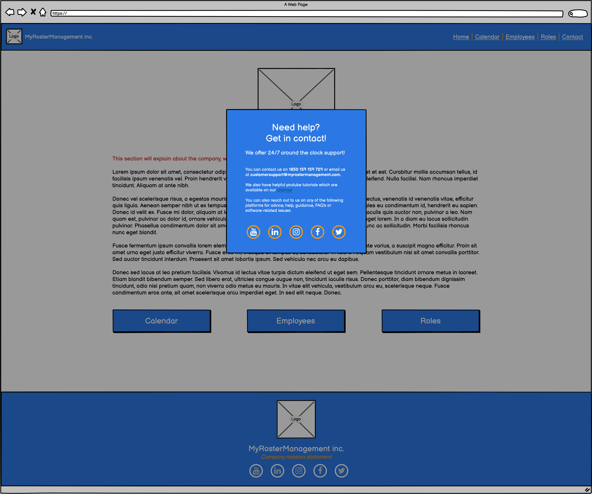
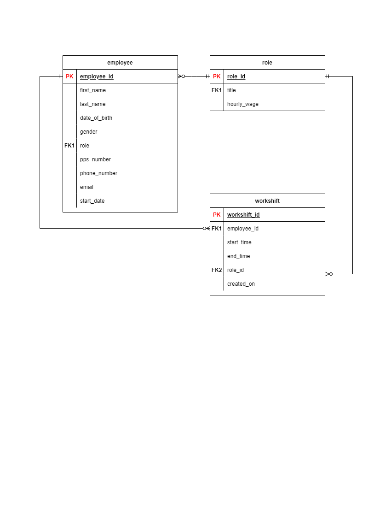

<!-- Add picture/banner of programme here -->
<!-- Add Table of Contents here -->
# MyRosterManagement
MyRosterManagement is a programme designed for SME's (Small and Medium Enterprises) to aid them in staff and roster management. The main purpose the software serves is to allow managers/shift supervisors to schedule and set up shifts for employees at certain times on certain days. It is designed to aid managers/shift supervisors in not only the planning and scheduling of shifts of the company's workforce, but will also allow them to create/edit/delete roles and employees too, should circumstances for the companies change.  
Another purpose the programme will serve is to easily view the different days and months of the year, and allow managers to visualise how the workforce is scheduled on certain days and weeks. From this, managers can then tactically decide if they require more/less staff. While able to be used for any SME, it is expected to be especially useful to SMEs which incorporate and heavily rely on shift work, such as bars, restauraunts, supermarkets, shops, cafes, warehouses and courier services.  
The full <!-- **[Insert Name here later](InsertLinkToProjectHereLater)** --> programme can be accessed here.

# Wireframes
Before starting development on MyRosterManagement, Balsamiq was used to form wireframes for each separate page within the programme. Basamiq was chosen due to it's efficiency and it's ability to reproduce relatively simplistic, yet easy to understand wireframes. This helped me to visualise ideas for each of the programmes pages and features, and organise how certain features would be laid out and implemented within the programme. Each wireframe created prior to development can be seen below:  
")
")
")

")
")

# Entity Relationship Diagram
Before starting development on MyRosterManagement, diagrams.net/draw.io was used to form an Entity Relationship Diagram (ERD) for the programme. As the programme relies heavily on models and databases, an ERD helped immensely in determining how to structure the database, including aiding in aspects such as relationships between tables, primary and foreign keys, and selecting fields for various tables. The ERD can be seen below:  

# Features
## Existing features

### Navigation
The programme offers a very simple and easy to use navigation system to navigate around the programme. This is not only in the form of moving to different pages, but also for features such as a contact modal and large buttons under each relevant table to manipulate the user's database.
#### **Images**  

### Contact us modal
Should any users experience any difficulty in using the software, there is a "Contact" modal which can be accessed on the navigation bar. This allows the user to contact the company via phone or email, and also offers means of contacting the company through social media pages.
#### **Images**  

### Footer
An attractive footer is included in the programme to offer the user a simple way of easily navigating to the social media pages of the company.
#### **Images**  

### CRUD (Create, Read, Update, Delete) functionality
On each table outlining the companies current records of employees, roles and scheduled workshifts, there are buttons which allow the user to manipulate these records. For example, a certified user may add a new employee and delete the replaced employee, and schedule their next workshift for when they wish.
#### **Images**  

### Account creation and login/logout functionality
The superuser will have the ability to create accounts for users, and will also have the ability to use CRUD functionality on the company's data. When creating a user, the superuser will also have the ability to grant these same permissions to the new user. This will prevent unauthorised users from editing/creating/deleting records, and also prevent them from registering other users.
#### **Images**  

### User permissions
As mentioned above, the programme is designed so that only authorised users can use CRUD functionality and create new users. Therefore, it is important that unauthorised users of the programme can access the information they need to gain benefit from the programme, but cannot see more personal details of the company, such as wages and employee phone numbers etc. And cannot use CRUD functionality on records. To solve this problem, all edit/delete/add buttons on each table have been hidden to unauthorised users. Furthermore, attempting to brute-force to certain URLs when logged in as an unauthorised user will simply return an `unauthorised.html` page and block the user from accessing CRUD functionality. This includes the `accounts/signup/` URL should an unauthorised user attempt to create a new user, as this could easily allow the programme to be hacked. When logged in as an unauthorised user, certain columns of certain tables are also hidden to prevent PPI (Private and Personal Information) from being accessed.