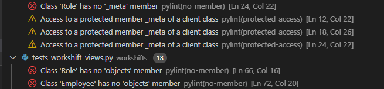

# Table of Contents
- [Table of Contents](#table-of-contents)
- [Testing](#testing)
- [Browser Compatibility](#browser-compatibility)
- [**Responsiveness**](#responsiveness)
        - [**Images**](#images)
- [Testing and identified bugs](#testing-and-identified-bugs)
  - [**W3 HTML validator**](#w3-html-validator)
        - [**Images**](#images-1)
        - [Example of irrelevant errors due to jinja templating language.](#example-of-irrelevant-errors-due-to-jinja-templating-language)
        - [Example of relevant errors uncovered.](#example-of-relevant-errors-uncovered)
  - [**W3C CSS validator**](#w3c-css-validator)
  - [**PEP 8**](#pep-8)
        - [**Images**](#images-2)
- [**Automated tests**](#automated-tests)
        - [**Images**](#images-3)
    - [**Forms testing**](#forms-testing)
      - [**Employees forms testing**](#employees-forms-testing)
        - [**Images**](#images-4)
      - [**Workshifts forms testing**](#workshifts-forms-testing)
        - [**Images**](#images-5)
      - [**Role forms testing**](#role-forms-testing)
        - [**Images**](#images-6)
      - [**Account forms testing**](#account-forms-testing)
        - [**Images**](#images-7)
    - [**Views testing**](#views-testing)
      - [**Employees views testing**](#employees-views-testing)
        - [**Images**](#images-8)
      - [**Workshifts views testing**](#workshifts-views-testing)
        - [**Images**](#images-9)
      - [**Role views testing**](#role-views-testing)
        - [**Images**](#images-10)
    - [**Models testing**](#models-testing)
      - [**Employees models testing**](#employees-models-testing)
        - [**Images**](#images-11)
      - [**Workshifts models testing**](#workshifts-models-testing)
        - [**Images**](#images-12)
      - [**Role models testing**](#role-models-testing)
        - [**Images**](#images-13)
- [Unfixed Bugs](#unfixed-bugs)

# Testing

# Browser Compatibility
Testing of the programme was carried out in Firefox, Microsoft Edge, Opera and Google Chrome. Throughout the different browsers, no significant changes were observed, and the programme remained consistent both aesthetically and functionally.

# **Responsiveness**
Incorporating responsiveness into the project was made relatively straightforward due to bootstraps Grid feature. Nevertheless, testing on the programme was carried out manually to ensure responsiveness down to screen size of 350px. With Bootstrap, a burger button was also implemented in place of the navbar on smaller screens, along with the use of horizontal scrolling through tables.  

Whilst manually testing for responsiveness, some small changes had to be made to ensure that the programme was fully responsive, including:

* Reducing margin on social media icons on footer, to prevent cutting off icons at smaller screens.
* Slightly reducing font-size of logo on navbar, to prevent cutting off the logo on smaller screens.

After implementing these changes, the programme was completely responsive at screen sizes down to 350px. Images can be seen below showcasing the programme's responsiveness:

##### **Images**
**Homepage**  
  

**Tables**  
  

**Contact modal**  

# Testing and identified bugs
The following tools and technologies were used to test this project:
## **W3 HTML validator**
For each HTML template in the project, W3 HTML validator was used to test if there were any syntax mistakes or bad practices used within the template. However, W3 HTML validator unfortunately does not consider Jinja templating language being used within the .html files. As a result, many errors were displayed which seemed to be a result of the validator's shortcomings. Images can be seen below of errors/issues being displayed purely because of the Jinja templating language used within the .html files.  

After reviewing these errors/issues displayed by the W3 HTML validator, it was determined that these errors/issues were clearly the result of the Jinja templating language not being taken into consideration by the test. Jinja is clearly a key component of the templates and is designed to be used with django, therefore it was decided that these errors were irrelevant.  

With that in mind, all templates were still tested and any errors which were found not to be related to Jinja were identified and corrected.  

Below are images which display some irrelevant issues displayed from the W3 HTML validator relating to Jinja, and also an example of how a genuine error was made and corrected.  

##### **Images**
##### Example of irrelevant errors due to jinja templating language.
**base.html testing image**

##### Example of relevant errors uncovered.
**table.html testing image**

## **W3C CSS validator**
Whilst bootstrap was used for the majority of styling throughout this project, a custom css style sheet (styles.css) was used to provide customer styling throughout the project. This can be seen in the orange coloring used in the brand logo and in the social media icons styling.

To test this custom-written CSS, the W3C CSS validator was used. Upon testing, no errors were discovered. The testing image can be seen below:  

 being tested")
## **PEP 8**
PEP 8 guidelines and practises were implemented when building this project. To test this, it was originally planned to use [pep8online.com](http://pep8online.com/). However, as of the time of creating this project, the website is currently not active and cannot be accessed. Therefore, it was decided to use the extention `pycodestyle` to test if the python code adhered to the PEP 8 guidelines and practises.

All python files contained PEP 8 errors of some kind, the most commone of which included:  

* E2 - Whitespace errors
* E3 - Blank line errors
* E5 - Line length errors
* W2 - Whitespace warnings

Whilst these errors were not causing fatal errors within the project or preventing the software from functioning as expected, it can still be considered bad practise to leave these errors within the project. This is mainly from a "code readability" perspective. In correcting these errors, the code will be easier to maintain in the future should updates/changes need to be implemented. Furthermore, future debugging will also be made much easier.

Unfortunately, there are still some very minor PEP 8 errors displayed in the problems tab of the terminal. These errors/warnings however, are not fatal, and do not impact the programme in any way, shape or form.

These errors include:

* `Class 'Role' has no '_meta' member.` This error occurs with multiple classes, not specifically with 'Role' class
* `Class 'Role' has no 'objects' member.` This error occurs with multiple classes, not specifically with the 'Role' class
* `Access to a protected member _meta of a client class.`

An image of these errors and warnings can be seen below:  
##### **Images**

# **Automated tests**
As part of the project, automated testing was made a key feature of the project. This was done to ensure accuracy of the models, forms and views built in the project. It was also incoporated to act as a safeguard against any bugs which may occur from future changes to the project. In total, 61 tests were constructed and used to test the forms, views and models across the projects 4 apps (accounts, employees, roles and workshifts). An image of all the 61 tests being ran can be seen below:  
##### **Images**

### **Forms testing**
Forms testing was carried out in the apps to ensure that a form could be successfully submitted and functioned without bugs, potentially preventing the form from submitting or sending incorrect data to the database.
#### **Employees forms testing**
The tests covered in the employee forms included:  
* Making sure the following fields are required:
  * employee_id
  * first_name
  * last_name
  * date_of_birth
  * gender
  * role
  * pps_number
  * phone_number
  * email
  * start_date
* Making sure that the following fields are present in the form for the user to fill out:
  * employee_id
  * first_name
  * last_name
  * date_of_birth
  * gender
  * role
  * pps_number
  * phone_number
  * email
  * start_date  

Please see below for testing images:  
##### **Images**

#### **Workshifts forms testing**
The tests covered in the workshift forms included:  
* Making sure the following fields are required:
  * employee_id
  * start_date
  * start_time
  * end_date
  * end_time
  * role_id
* Making sure that the following fields are present in the form for the user to fill out:
  * workshift_id
  * employee_id
  * start_date
  * start_time
  * end_date
  * end_time
  * role_id  

Please see below for testing images:  
##### **Images**

#### **Role forms testing**
The tests covered in the role forms included:  
* Making sure the following fields are required:
  * role_id
  * title
  * hourly_wage
* Making sure that the following fields are present in the form for the user to fill out:
  * role_id
  * title
  * hourly_wage  

Please see below for testing images:  
##### **Images**

#### **Account forms testing**
In the account form, we have 5 fields: username, password, first_name, last_name, and is_staff. django-allauth was used to create the programme's signup form, and as such, handling/testing of username and password is handled extensively by this package. Therefore, it was deemed out of scope to test these two fields, and instead test our own custom fields; first_name, last_name, and is_staff.  

The tests covered in the account forms included:  
* Making sure the following fields are required:
  * first_name
  * last_name
* Making sure the following fields are **not** required:
  * is_staff  

Please see below for testing images:  
##### **Images**

### **Views testing**
Views testing was carried out in the project to ensure that a user **with the relevant permissions** could successfully access the relevant pages which fell under their permissions, and successfully create/edit/delete records which they had access to. Likewise, it was also necessary that **unauthorized users** could have access to certain pages, but be prevented from others. Certain tests in the views show how unauthorized users simply cannot access certain urls, even if the urls are brute-forced(manually typed into the address bar).
#### **Employees views testing**
The tests covered in the employee views included:  
* Making sure that **authorized** users **can**:
  * Access the employee table
  * Access the add-employee page
  * Access the edit-employee page
  * Add an employee to the database
  * Delete an employee from the database
* Making sure that **unauthorized** users **can**:
  * Access the employee table
* Making sure that **unauthorized** users **cannot**:
  * Access the add-employee page
  * Access the edit-employee page
  * Add an employee to the database
  * Delete an employee from the database  

Please see below for testing images:  
##### **Images**

#### **Workshifts views testing**
The tests covered in the workshift views included:  
* Making sure that **authorized** users **can**:
  * Access the workshift table
  * Access the add-workshift page
  * Access the edit-workshift page
  * Add a workshift to the database
  * Delete a workshift from the database
* Making sure that **unauthorized** users **can**:
  * Access the workshift table
* Making sure that **unauthorized** users **cannot**:
  * Access the add-workshift page
  * Access the edit-workshift page
  * Add a workshift to the database
  * Delete a workshift from the database  

Please see below for testing images:  
##### **Images**

#### **Role views testing**
The tests covered in the role views included:  
* Making sure that **authorized** users **can**:
  * Access the role table
  * Access the add-role page
  * Access the edit-role page
  * Add a role to the database
  * Delete a role from the database
* Making sure that **unauthorized** users **can**:
  * Access the role table
* Making sure that **unauthorized** users **cannot**:
  * Access the add-role page
  * Access the edit-role page
  * Add a role to the database
  * Delete a role from the database

Please see below for testing images:  
##### **Images**

### **Models testing**
Models testing was carried out in the project to ensure that all models can successfully handle and format data correctly. It is imperative that certain constraints within the model function accurately so as to act as a safeguard in preventing invalid data entering the database. This is especially the case with values within models which need to be unique.
#### **Employees models testing**
The tests covered in the employee models included:  
  * Testing if the pps_number field is unique
  * Testing if the email field is unique  

Please see below for testing images:  
##### **Images**

#### **Workshifts models testing**
The tests covered in the workshift models included:  
  * Testing if the created_on field is automatic  

Please see below for testing images:  
##### **Images**

#### **Role models testing**
The tests covered in the role models included:  
  * Testing if the title field is less than 50 characters
  * Testing if the hourly_wage field can only have 2 decimal places
  * Testing if the hourly_wage field has less than 5 digits

Please see below for testing images:  
##### **Images**

# Unfixed Bugs
There are no unfixed bugs that I am aware of.