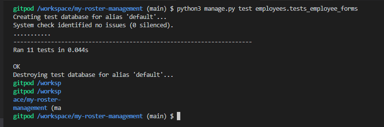
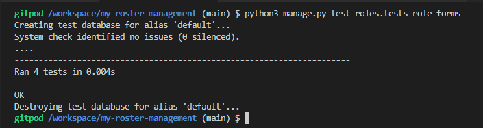

# Testing

# **Responsiveness**

# Testing and identified bugs
The following tools and technologies were used to test this project:
## **W3 HTML validator**
## **W3C CSS validator**
## **PEP8online.com**

# **Automated tests**
As part of the project, automated testing was made a key feature of the project. This was done to ensure accuracy of the models, forms and views built in the project. It was also incoporated to act as a safeguard against any bugs which may occur from future changes to the project. In total, 61 tests were constructed and used to test the forms, views and models across the projects 4 apps (accounts, employees, roles and workshifts). An image of all the 61 tests being ran can be seen below:  
##### **Images**

### **Forms testing**
Forms testing was carried out in the apps to ensure that a form could be successfully submitted and functioned without bugs, potentially preventing the form from submitting or sending incorrect data to the database.
#### **Employees forms testing**
The tests covered in the employee forms included:  
* Making sure the following fields are required:
  * employee_id
  * first_name
  * last_name
  * date_of_birth
  * gender
  * role
  * pps_number
  * phone_number
  * email
  * start_date
* Making sure that the following fields are present in the form for the user to fill out:
  * employee_id
  * first_name
  * last_name
  * date_of_birth
  * gender
  * role
  * pps_number
  * phone_number
  * email
  * start_date  

Please see below for testing images:  
##### **Images**

#### **Workshifts forms testing**
The tests covered in the workshift forms included:  
* Making sure the following fields are required:
  * employee_id
  * start_date
  * start_time
  * end_date
  * end_time
  * role_id
* Making sure that the following fields are present in the form for the user to fill out:
  * workshift_id
  * employee_id
  * start_date
  * start_time
  * end_date
  * end_time
  * role_id  

Please see below for testing images:  
##### **Images**

#### **Role forms testing**
The tests covered in the role forms included:  
* Making sure the following fields are required:
  * role_id
  * title
  * hourly_wage
* Making sure that the following fields are present in the form for the user to fill out:
  * role_id
  * title
  * hourly_wage  

Please see below for testing images:  
##### **Images**

#### **Account forms testing**
In the account form, we have 5 fields: username, password, first_name, last_name, and is_staff. django-allauth was used to create the programme's signup form, and as such, handling/testing of username and password is handled extensively by this package. Therefore, it was deemed out of scope to test these two fields, and instead test our own custom fields; first_name, last_name, and is_staff.  

The tests covered in the account forms included:  
* Making sure the following fields are required:
  * first_name
  * last_name
* Making sure the following fields are **not** required:
  * is_staff  

Please see below for testing images:  
##### **Images**

### **Views testing**
Views testing was carried out in the project to ensure that a user **with the relevant permissions** could successfully access the relevant pages which fell under their permissions, and successfully create/edit/delete records which they had access to. Likewise, it was also necessary that **unauthorized users** could have access to certain pages, but be prevented from others. Certain tests in the views show how unauthorized users simply cannot access certain urls, even if the urls are brute-forced(manually typed into the address bar).
#### **Employees views testing**
The tests covered in the employee views included:  
* Making sure that **authorized** users **can**:
  * Access the employee table
  * Access the add-employee page
  * Access the edit-employee page
  * Add an employee to the database
  * Delete an employee from the database
* Making sure that **unauthorized** users **can**:
  * Access the employee table
* Making sure that **unauthorized** users **cannot**:
  * Access the add-employee page
  * Access the edit-employee page
  * Add an employee to the database
  * Delete an employee from the database  

Please see below for testing images:  
##### **Images**

#### **Workshifts views testing**
The tests covered in the workshift views included:  
* Making sure that **authorized** users **can**:
  * Access the workshift table
  * Access the add-workshift page
  * Access the edit-workshift page
  * Add a workshift to the database
  * Delete a workshift from the database
* Making sure that **unauthorized** users **can**:
  * Access the workshift table
* Making sure that **unauthorized** users **cannot**:
  * Access the add-workshift page
  * Access the edit-workshift page
  * Add a workshift to the database
  * Delete a workshift from the database  

Please see below for testing images:  
##### **Images**

#### **Role views testing**
The tests covered in the role views included:  
* Making sure that **authorized** users **can**:
  * Access the role table
  * Access the add-role page
  * Access the edit-role page
  * Add a role to the database
  * Delete a role from the database
* Making sure that **unauthorized** users **can**:
  * Access the role table
* Making sure that **unauthorized** users **cannot**:
  * Access the add-role page
  * Access the edit-role page
  * Add a role to the database
  * Delete a role from the database

Please see below for testing images:  
##### **Images**

### **Models testing**
Models testing was carried out in the project to ensure that all models can successfully handle and format data correctly. It is imperative that certain constraints within the model function accurately so as to act as a safeguard in preventing invalid data entering the database. This is especially the case with values within models which need to be unique.
#### **Employees models testing**
The tests covered in the employee models included:  
  * Testing if the pps_number field is unique
  * Testing if the email field is unique  

Please see below for testing images:  
##### **Images**

#### **Workshifts models testing**
The tests covered in the workshift models included:  
  * Testing if the created_on field is automatic  

Please see below for testing images:  
##### **Images**

#### **Role models testing**
The tests covered in the role models included:  
  * Testing if the title field is less than 50 characters
  * Testing if the hourly_wage field can only have 2 decimal places
  * Testing if the hourly_wage field has less than 5 digits

Please see below for testing images:  
##### **Images**
